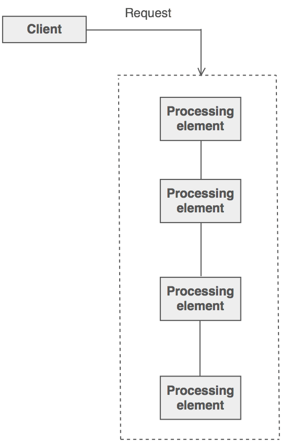
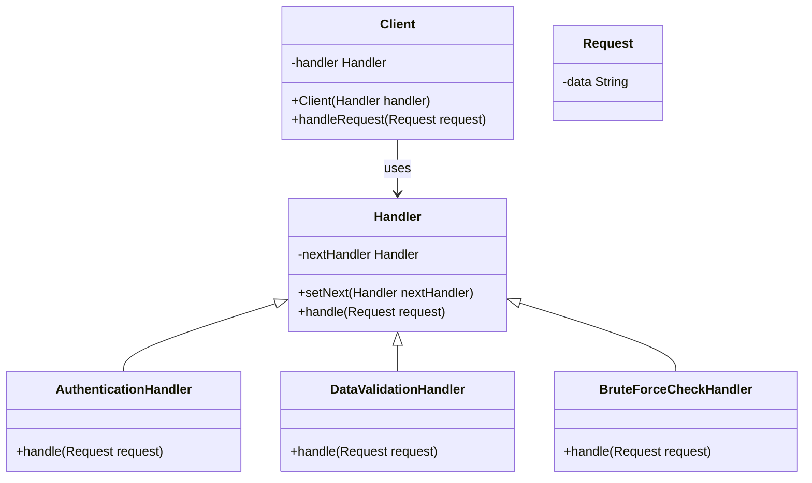
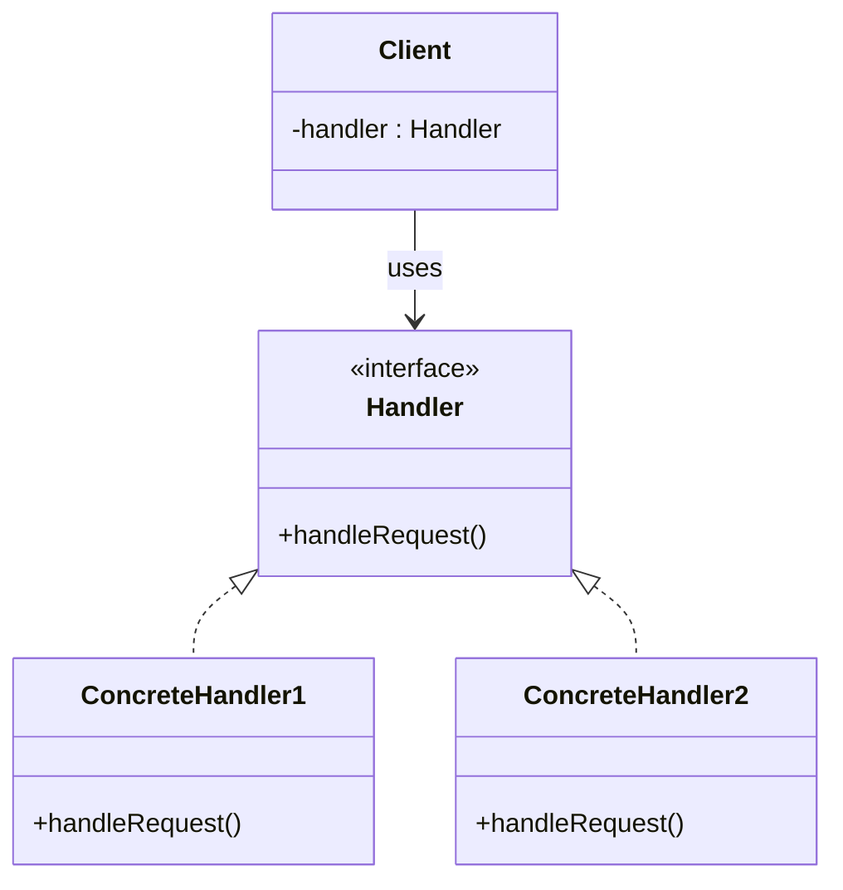

**Behavioral design patterns** are concerned with algorithms and the assignment of responsibilities between objects.
  
# What is Chain of responsibility

Chain of Responsibility is a behavioral design pattern that lets you pass requests along a chain of handlers. Upon receiving a request, each handler decides either to process the request or to pass it to the next handler in the chain.


# Implement

Encapsulate the processing elements inside a "pipeline" abstraction; and have clients "launch and leave" their requests at the entrance to the pipeline.



### Solution


### Structure


- Handler: Defines an interface to handle requests.
- ConcreteHandler: Implements methods from handler.
- Client: Creates requests and those requests will be sent to the receiving objects.

### Demo Implement

View source code for more info

# Pros and Cons 

## Pros
- Reduced coupling
- You can control the order of request handling.
- Single Responsibility Principle: You can decouple classes that invoke operations from classes that perform operations.
- Open/Closed Principle: You can introduce new handlers into the app without breaking the existing client code.

## Cons

- Some requests may end up unhandled.
  

# When to Apply Chain-Of-Responsibility Pattern

- Handling Multiple Request Types: When your program needs to handle multiple request types and you cannot or do not want to predetermine the specific request types and the order in which they should be handled, this pattern is useful. It allows you to organize a chain of processing objects, each of which will handle a specific request type or pass it on to the next object in the chain.

- Sequential Processing: This pattern is also suitable when a task needs to be handled sequentially. In this case, each object in the chain will perform a portion of the task or decide whether to pass the task on to the next object in the chain.

- Decentralization of Responsibility: When you want to delegate responsibility for handling requests, this pattern is also useful. It allows each object in the chain to focus on a small portion of the task, making the handling easier to manage and maintain.

- Flexibility in Request Handling: the Chain-Of-Responsibility pattern facilitates flexibility in request handling. You can easily change or extend the handling chain without changing the source code of existing handling objects.


# Usecase

- Validation and processing of data entered in registration forms: Validation steps such as checking email format, checking password strength, or checking information already in the system can be performed by successive handlers in the chain.
- Handling events and interactions in the game: Events such as collisions, interactions with objects, or triggering special effects can be handled through a chain of handlers in the game to ensure flexibility and extensibility.
- Handling messages in a chat application: can be handled through multiple layers: checking for spam, checking for inappropriate content, notifying the user, and finally sending the message. Each layer can decide whether to process or forward the message.

# Usecase to apply into project
- Use to update values object of entity

```javascript
function updateVessel(newInfo: any){
    if(newInfo instanceof VesselOilWaterCapacityValueObject){
        Vessel.updateVesselOilWaterCapacity(newInfo)
    }
    if(newInfo instanceof VesselDailyConsumptionValueObject){
        Vessel.updateVesselDailyConsumption(newInfo)
    }
    if(newInfo instanceof VesselMainEngineValueObject){
        Vessel.updateVesselMainEngine(newInfo)
    }
}

//--------------------------------------------

type SomeType = VesselOilWaterCapacityValueObject | VesselDailyConsumptionValueObject | VesselMainEngineValueObject

function UpdateVessel(newInfo: SomeType){
    let handlerUpdateVesselOilWaterCapacity = new UpdateVesselOilWaterCapacityHandler(vessel);
    let handlerUpdateVesselDailyConsumption = new UpdateVesselDailyConsumptionHandler(vessel);
    let handlerUpdateVesselMainEngine = new UpdateVesselMainEngineHandler(vessel);

    handlerUpdateVesselOilWaterCapacity.setNext(handlerUpdateVesselDailyConsumption)
    handlerUpdateVesselDailyConsumption.setNext(handlerUpdateVesselMainEngine)

    let client = new UpdateVesselClient(handlerUpdateVesselOilWaterCapacity);
    client.handleUpdate(newInfo);
}


class UpdateVesselOilWaterCapacityHandler(){
    private vessel

    contructor(vessel: Vessel){
        this.vessel = vessel
    }

    handleUpdate(newInfo: SomeType){
        if (newInfo instanceof VesselOilWaterCapacityValueObject) {
            vessel.updateVesselOilWaterCapacity()
        } else if (this.next != null) {
            this.next.handleRequest(request);
        }
    }
}

```

### Note

- Make sure there exists a "safety net" to "catch" any requests which go unhandled.
- Do not use Chain of Responsibility when each request is only handled by one handler, or, when the client object knows which service object should handle the request.