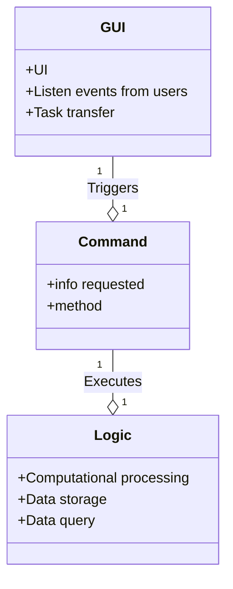
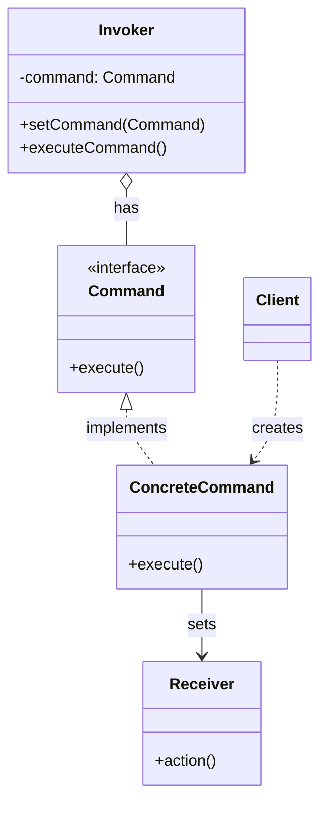

# What is Command Patern

**Command** is a behavioral design pattern that turns a request into a stand-alone object that contains all information about the request. This transformation lets you pass requests as a method arguments, delay or queue a request’s execution, and support undoable operations.

# Implement

### Solution

### Structure

1. Command (Interface):
- This is an interface or abstract class that defines the execute() method.
- The purpose is to create a common interface for all concrete commands.

2. ConcreteCommand:
- Is a concrete class that implements the Command interface.
- In the execute() method, it calls the corresponding method of the Receiver.

3. Invoker:
- Stores a reference to a Command object.
- Calls the execute() method on the Command object to execute the request.

4. Receiver:
- Knows how to perform the operations required to execute the request.
- Each ConcreteCommand will be associated with a Receiver.

5. Client:
- Creates a ConcreteCommand object and sets up its receiver.
- Can pass the Command to the Invoker for execution.

### Demo Implement

# Pros and Cons
## Pros

-   Single Responsibility Principle: You can decouple classes that invoke operations from classes that perform these operations.
-  Open/Closed Principle: You can introduce new commands into the app without breaking existing client code.
-   You can implement undo/redo.
-   You can implement deferred execution of operations.
-   You can assemble a set of simple commands into a complex one.

## Cons

- The code may become more complicated since you’re introducing a whole new layer between senders and receivers.

# When to Apply Chain-Of-Responsibility Pattern

- Use the Command pattern when you want to parametrize objects with operations.
- Use the Command pattern when you want to queue operations, schedule their execution, or execute them remotely.
- Use the Command pattern when you want to implement reversible operations.

# Usecase

- Text processing applications: to perform operations such as cutting, copying, pasting, or transposing text
- Resolving API requests in web applications: Command classes can represent operations such as creating, updating, or deleting data, helping to handle API requests flexibly and efficiently.
- Financial transaction systems: used to perform transactions such as transferring money, paying, or canceling transactions
- Graphics applications with drawing tools: used to handle operations such as drawing lines, drawing circles, coloring, or rotating drawings
- Online ticket booking systems: can be applied to handle actions such as selecting seats, booking tickets, or canceling tickets

# Usecase to apply into our project

# Note
- Chain of Responsibility can use Command to represent requests as objects.
- Command can use Memento to maintain the state required for an undo operation.
- Two important aspects of the Command pattern: interface separation (the invoker is isolated from the receiver), time separation (stores a ready-to-go processing request that's to be stated later).