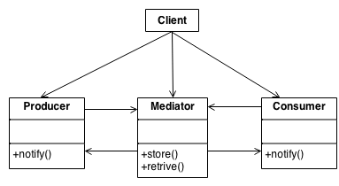

# Mediator Pattern

## What is Mediator pattern?

Mediator is a behavioral design pattern that lets reduce chaotic dependencies between object. The pattern restricts direct communications between the objects and forces them to collaborate only via mediator object.

## Use cases

1. GUI Systems with complex interactions
   Example:
   In a dialog box with a text field, a button, and a dropdown, changes in the dropdown could enable or disable the button or clear the text field. The Mediator centralizes this logic
2. Chat room applications
   Example:
   User A sends a message -> Mediator (chat room) -> Mediator forwards the message to User B, C, and D.
3. Notification Systems
   Example:
   Error occurs in a service -> Mediator handles notification -> Sends alert to admin, logs the issue, and initiates corrective services.

## Structure:

- **Mediator interface**: interface declares methods of communication with components, which usually include just a single notification method.
- **Concrete components**: various classes that contain some business logic.

## When to use

1. Use the Mediator pattern when it’s hard to change some of the classes because they are tightly coupled to a bunch of other classes.
2. Use the pattern when you can’t reuse a component in a different program because it’s too dependent on other components.
3. Use the Mediator when you find yourself creating tons of component subclasses just to reuse some basic behavior in various contexts.

## How to implement

1. Identify a group of tightly coupled classes which would benefit from being more independent.
2. Declare the mediator interface and describe the desired communication protocol between mediators and various components. In most cases, a single method for receiving notifications from components is sufficient.
3. Implement the concrete mediator class. Consider storing references to all components inside the mediator. This way, you could call any component from the mediator's methods.
4. Make the mediator responsible for the creation and destruction of component objects. After this, the mediator may resemble a factory or a facade.
5. Components should store a reference to the mediator object. The connection is usually established in the component's contructor, where a mediator is passed as an argument.
6. Change the component's code so that they can call the mediator's notification method instead of methods on other components. Extract the code that involves calling other components into the mediator class. Execute this code whenever the mediator receives notifications from that component.

## Class diagram

## Pros and cons

### Pros:

- Single responsibility principle. Can extract the communications between various components into a single place, making it easier to comprehend and maintain.
- Open/Closed Principle. Can introduce new mediators without having to change the actual components.
- Reduce coupling between various components of a program.
- Reuse individual components more easily.

### Cons:

- Over time a mediator can evolve into a God Object.
