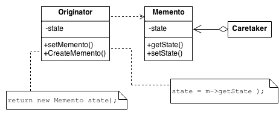

# Memento Pattern

## What is Memento pattern ?

Memento is a behavioral design pattern that lets you save and restore the previous state of an object without revealing the details of its implementation.

## Use cases

1. Undo/redo functionality in applications
   Example:
   Text Editors: Every time a user makes a change (e.g., typing, deleting text), the state (content) of the document can be saved as a memento.
2. Snapshot or versioning systems
   Example:
   Document Management Systems: A document can have multiple versions saved over time, and the user can revert to any previous version of the document.

## Structure

- **Originator**: is the object whose state you want to save and restore. It can create a memento and use a memento to restore its state.
- **Memento**: is a simple object that stores the state of the Originator. No business logic, only serves to hold the state.
- **Caretaker**: is responsible for keeping track of the mementos. No modify or access the contents of the memento.

## Class diagram

## When to use

1. Use the Memento pattern when you want to produce snapshots of the object’s state to be able to restore a previous state of the object.
2. Use the pattern when direct access to the object’s fields/getters/setters violates its encapsulation.

## How to implement

1. Determine what class will play the role of the originator.
2. Create the memento class. Declare a set of fields that mirror the fields declared inside the originator class.
3. Make the memento class immutable.
4. Create the memento class (base on the programming language, if it support nested classes, nest the memento inside the originator. If not extract a blank interface from the memento class and make all other objects use it to refer to the memento, may add some metadata operations to the interface, but no expose the originator's state)
5. Add a method for producing mementos to the originator class.
6. Add a method for restoring the originator's state to its class
7. The caretaker should know when to request new mementos from the originator, how to store them and when to restore the originator with a particular memento.
8. The link between caretaker and originators may be moved into the memento class. In this case, each memento must be connected to the originator that had created it. The restoration method would also move to the memento class. (only make sence if the memento class is nested into originator)

## Pros and Cons

Pros:

- Produce snapshots of the object's state without violating its encapsulation.
- Simplify the originator's code by letting the caretaker maintain the history of the originator's state.

Cons:

- The app might consume lots of RAM if clients create mementos too often.
- Caretakers should track the originator's lifecircle to be able to destroy obsolete mementos.
- Most dynamic programming languages, such as PHP, Python and JavaScript, can't guarantee that the state within the memento stays untouched.
